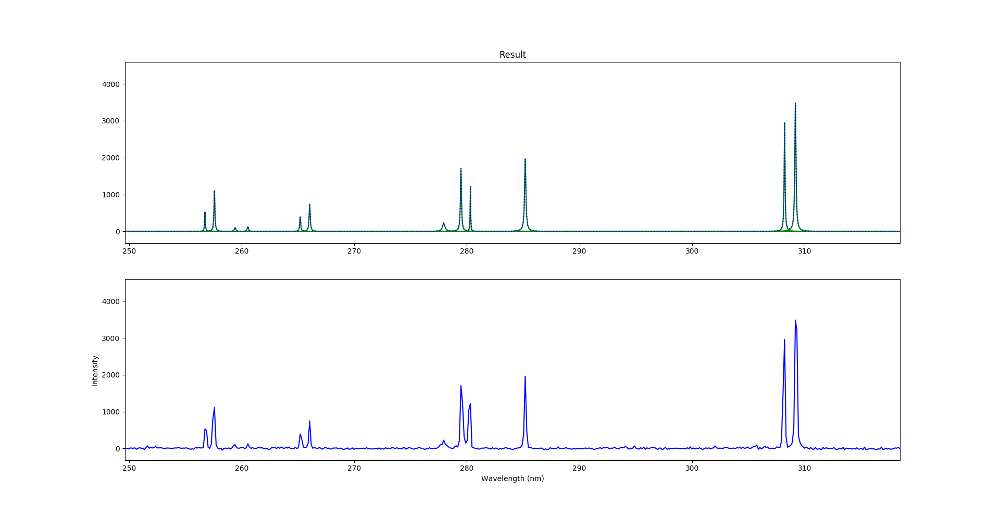
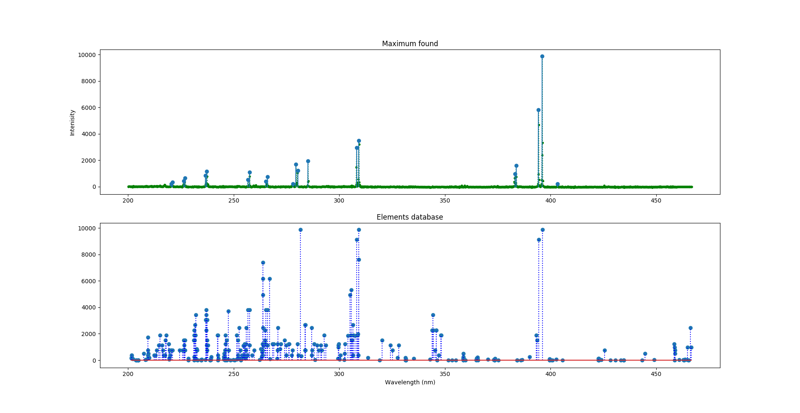

# LIBS-analysis

A library to fit lorentzian functions to experimental data for easier and faster elemental analysis.

## Instructions

You should start installing the requirements:

    pip install -r requirements.txt

To make an analysis using the default configuration file (params.txt), just run
    
    python script.py
    
Using python3. 

You can change the configuration editing the params.txt file.

- __file__: Specify a relative or absolute path to the file you want to analyze. The file's content must be an N x 2 matrix, with the wavelengths in the first column and intensities in the second one.

- __elements_from_NIST__: A list with the elements you want to retrieve from the NIST Atomic Spectra Database Lines Form webiste. You can write them in the same way you search in their site.

- __analysis_options__: Parameters for the analysis to run.

- __elements_min_intensity__: The lines retrieved from NIST can be filter by their observed relative intensity using this param. All the intensities from NIST are scaled to your data, so this value corresponds to YOUR relative intensity.

- __wavelength_min__: Wavelength to start analysis.

- __wavelength_max__: Wavelength to end analysis.

- __adjust_manually__: If true, the user will be able to add new or remove maximum found by the script before the fit calculation is done.

- __minimal_separation_between_maximum__: Lorentzians' gamma are estimated evaluating points beside the maximum found. Calculations for lorentzian functions to close to each other can lead to errors. This parameter fix a minimal separation between maximum found. 2 use to be a good number (default).

- __iterations__: Sometimes, errors detecting maximum's position can lead to negative intense functions after first fit try. Those functions can be removed and a new iteration can be made for a new fit. The number of iterations are specified here. Default is 2.

- __intensity_detection_umbral__: Maximum are only detected over this relative intensity umbral. Default 200.

- __spectra_output_file__: Specify a relative or absolute path to save the output spectra file after fit.

- __maximum_output_file__: Specify a relative or absolute path to save the output file with the lorentzian functions' posistion and intensity found after fit.

- __resolution__: After the fit, the script pops a plot to compare the experimental data with the lorentzian functions estimated, and that's the plot that will be save in the output files. With this parameter you can specify how many _times_ the original resolution you want to see and save. The default is 20, so the final plot and files will have 20 times more wavelength points than the original experimental data.

## Retrieving data from NIST

In the configuration file you can add elements to the "elements_from_NIST" array. This elements will be retrieved from NIST online database public here:

https://physics.nist.gov/PhysRefData/ASD/lines_form.html

    
